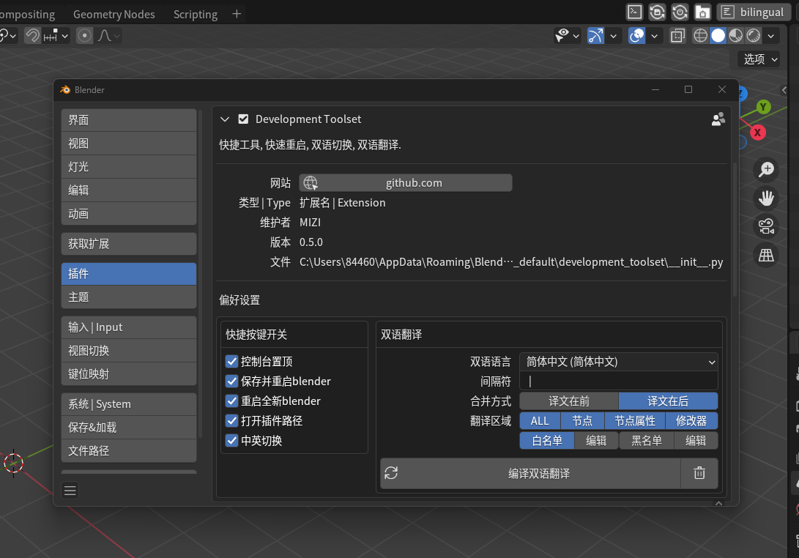
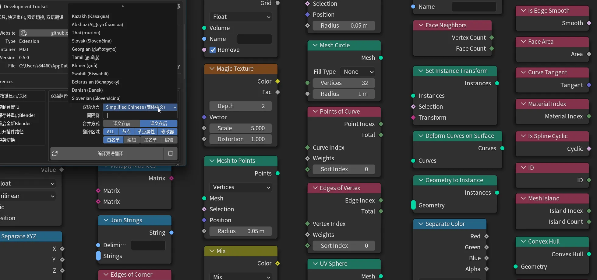
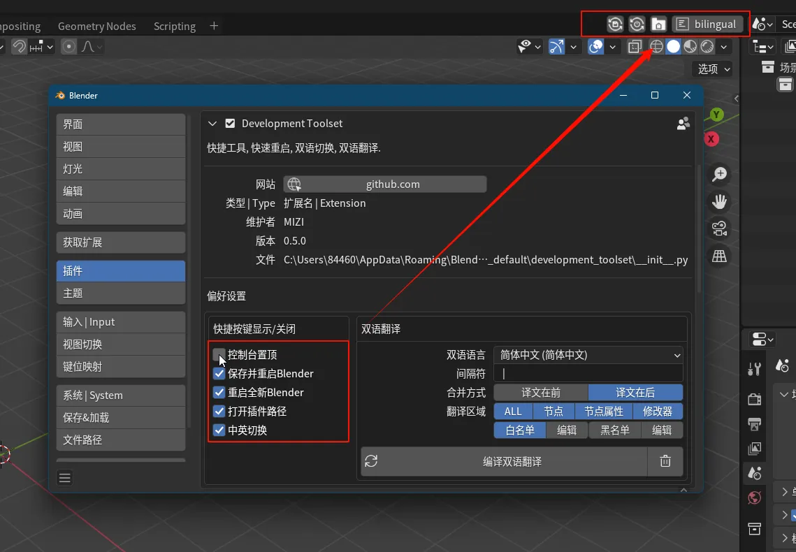

# BilingualTranslationToolkit

[ZH](https://github.com/zxsama/BilingualTranslationToolkit/blob/main/README.md) | [EN](https://github.com/zxsama/BilingualTranslationToolkit/blob/main/README_EN.md)

一个用于blender的双语界面显示的工具集。

> 支持Win、Linux、Mac, blender版本号 ≥ 3.3

## 双语界面翻译

从Blender原有翻译文件编译的双语界面，支持Blender内置的大多数语言和一定程度的格式定义，也支持对单个词语的黑、白名单。

> 初次使用：
>   1. 安装插件
>   2. 点击插件设置中的 `双语翻译初始化(自动重启)` 按钮
>   3. 等待blender自动重启
>   4. 再次点击插件设置中的 `编译双语翻译` 按钮

## 快捷按键：

### 按键功能：

- 控制台置顶(仅Windows)
- 保存并重启Blender
- 重启全新Blender
- 打开插件路径
- 语言切换

### 功能演示

## Q&A

1. 为什么有未双语显示的文本？

- 本插件使用官方翻译文本进行双语显示，官方文本中未翻译的内容同样也不会显示。

2. 为什么安装后不显示双语翻译？

- 第一次使用需要按照上述初次使用中的步骤设置，如有报错可以提交issue。

